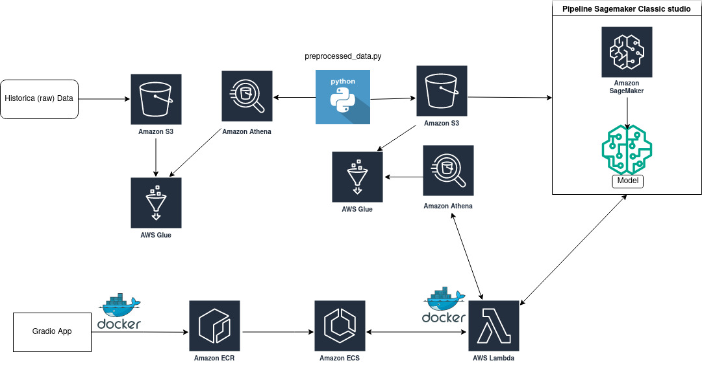

# Negative reviews summarization


<a target="_blank" href="https://cookiecutter-data-science.drivendata.org/">
    
</a>

This project aims to summarize all negative reviews of a product and classify them in one of the topics in a few words to detect which are the main customer complaints about it. The model is deployed in AWS and stakeholders can access these words by entering the product ID in a gradio web API.

## Project Organization

```
├── LICENSE            <- Open-source license if one is chosen
├── Makefile           <- Makefile with convenience commands like `make data` or `make train`
├── README.md          <- The top-level README for developers using this project.
├── data
│   ├── external       <- Data from third party sources.
│   ├── interim        <- Intermediate data that has been transformed.
│   ├── processed      <- The final, canonical data sets for modeling.
│   └── raw            <- The original, immutable data dump.
│
├── docs               <- A default mkdocs project; see mkdocs.org for details
│
├── models             <- Trained and serialized models, model predictions, or model summaries
│
├── notebooks          <- Jupyter notebooks. Naming convention is a number (for ordering),
│                         the creator's initials, and a short `-` delimited description, e.g.
│                         `1.0-jqp-initial-data-exploration`.
│
├── pyproject.toml     <- Project configuration file with package metadata for topic_modelling_negative_reviews
│                         and configuration for tools like black
│
├── references         <- Data dictionaries, manuals, and all other explanatory materials.
│
├── reports            <- Generated analysis as HTML, PDF, LaTeX, etc.
│   └── figures        <- Generated graphics and figures to be used in reporting
│
├── setup.cfg          <- Configuration file for flake8
│
└── topic_modelling_negative_reviews                <- Source code for use in this project.
    │
    ├── __init__.py    <- Makes topic_modelling_negative_reviews a Python module
    │
    │
    ├── lambda_function       <- Script to create AWS lambda function that requests model endpoint
    │   └── Dockerfile
    │   └── lambda_function.py
    │   └── requirements.txt   
    │
    ├── model_deploy         <- Script to Deploy the model in AWS Sagemaker
    │   ├── inference.py
    │   └── predict.py
    │
    └── model_fit <- Scripts to create exploratory and results oriented visualizations
    │   |── bert-topic.py
    │   └── Dockerfile
    │   └── train.py
    ├── preprocessing_data        <- Script to preprocess reviews before training
    │   ├── poetry.lock
    │   └── preprocessing.py
    │   ├── preprocessing_data.py
    │   └── pyproject.toml

```

--------

## 2. Business Assumptions
* Select only reviews in the English language.
* Select reviews with ratings of 3 stars or fewer.
* Consider reviews as a combination of their text and title.
* Select reviews whose number of characters ranges between 20 and 1000.
* Select only reviews with a negative sentiment.
* The topic selection is based on the average of all reviews for a specific product.

## 3. Dataset
The dataset comprises approximately 9 million negative reviews (3 or fewer stars) of electronic products sold on Amazon. It also includes a product metadata dataset with features such as product ID, title, description, images, etc.

Features used:

Review dataset
* rating: Rating of the product
* title: Title of the user review
* text: Text body of the user review
* parent_asin: Parent ID of the product. Note: Products with different colors, styles, sizes belong to the same parent ID. 
* verified_purchase: User purchase verification

Metadata dataset
* title: name of the product
* parent_asin: Parent ID of the product.

## 4. Tools used

* Python
* Jupyter notebook
* Git and Github
* AWS Sagemaker
* AWS Glue and Athena
* AWS S3
* AWS ECR and ECS
* AWS Lambda Function
* Gradio
* Docker
* Bertopic
* Spacy

## 5. Solution Planning

This project was developed based on the CRISP-DM framework with additional steps tailored for deployment:

Step 1. Data Retrieval: Create two AWS crawlers to retrieve data from both review and metadata datasets stored in an S3 bucket, and map these data in AWS Glue catalog to create a database.
Step 2. Data Selection: Query review data with 3 or fewer stars using AWS Athena and save this dataset in a Parquet format.
Step 3. Data Preprocessing: Describe and clean data in a Jupyter notebook—analyze dimensions, check and remove NAs, merge title and review text, detect review language.
Step 4. Preprocessing Script: Code a Python script and Dockerfile to preprocess data and save it in an S3 bucket.
Step 5. Model Training: Code training model and inference scripts and Dockerfiles to train and deploy the BERTopic model in SageMaker.
Step 6. Lambda Function: Code and run an AWS Lambda function script and Dockerfile to request the model endpoint.
Step 7. Web API: Code an API script and Dockerfile to host the Gradio web API in an ECS container.


## 6. Project Architecture

The project architecture illustrates the data flow and infrastructure setup in AWS, detailing each step from data retrieval to user interaction via the web app.



The historical data (raw) is stored in an S3 bucket, and an AWS Glue Crawler catalogs this data. We use AWS Athena to query the inside scripts. With preprocessed_data script, data is cleaned (remove NAs and emojis and positive reviews and other steps) and embedding reviews is created. This preprocessed data is saved in S3 bucket. This data is utilized to train Bertopic model in sagemaker. Then another script is used to deploy model and create endpoint.

The user types the product ID on gradio APP and sends a request to lambda function. Lambda function queries embeddings, product name and preprocessed reviews of this product in preprocessed dataset. Then it averages embeddings and sends this output to model inference endpoint. The model uses cosine similarity to compare what is the topic embedding closer to average product embedding and assign it to this topic. Then, with the assigned topic, model endpoint returns the top 10 words that summarize this topic. Lambda function returns to gradio api product name and these tops 10 words which then are shown to user.

## 7. Machine Learning Model Applied

The approach used to classify the reviews in topics was topic modeling. Topic modeling is a type of unsupervised machine learning technique used to identify topics or themes within a collection of documents. It identifies common keywords or phrases in texts and groups (clusterize) those words under topics to summarize these documents. These keywords tend to co-occur frequently across documents. 

The topic modeling approach used was BERTopic, which is an advanced topic modeling technique that leverages BERT (Bidirectional Encoder Representations from Transformers) transformer-based deep learning models to identify topics in large text collections.

As the focus is to find topics of just negative aspects of the reviews, is used spacy tokenizer to select just tokens (words) that customers have written about bad aspects of the product. For example, in a review like: "*Bad investment, poor advertising. Did not do anything I was told it would, even by your own people. Does not work with my LG TV as they said it would*", 'Bad', 'poor', 'said' tokens were selected. To achieve that, Name entity recognition (NER), Dependent Parser (DP) and Part of Speech (POS) were applied in tokenizer model. 

After the first model was fit, 20 topics were found. In the image below one can see the top 5 words that summarize the 10 topics with more assigned documents.


## 8. Web Application

The web API, built using Gradio, allows clients to enter a product ID and receive words that summarize all negative reviews associated with it along with some representative reviews.


## 9. Next steps

Future improvements include:

* Automating training and deployment steps in SageMaker pipelines.
* Utilizing GPUs for model training.
* Analyzing and merging similar topics.
* Testing and adjusting new hyperparameters.
* Exploring other vectorization and clustering techniques, such as Gaussian Mixture Models.
* Reducing redundancy in tokens with similar meanings.
